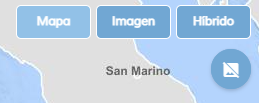
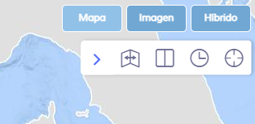

<p align="center">
  
</p>
<h1 align="center"><strong>APICNIG</strong> <small>🔌 M.plugin.ComparePanel</small></h1>

<p align="center">
  <a title="MIT License" href="LICENSE.md">
    
  </a>
  <a title="Node version" href="#">
    
  </a>  
  <a title="NPM version" href="#">
    
  </a>
  <a title="Language" href="https://www.w3schools.com/html/" target="_blank">
    
  </a>  
  <a title="Language" href="https://www.w3schools.com/js/" target="_blank">
    
  </a>
  <a title="Language" href="https://www.w3schools.com/css/" target="_blank">
    
  </a> 

  <br />
  <br />
</p>

## Descripción 👷

Plugin que agrupa los diversos plugins comparadores en una misma herramienta, compuesta de una barra de herramientas de comparación.

| Herramienta cerrada |Despliegue vertical|Despliegue horizontal|
|:----:|:----:|:-----:|
||||


## Dependencias 👷

- comparepanel.ol.min.js
- comparepanel.ol.min.css


```html
 <link href="../../plugins/comparepanel/comparepanel.ol.min.css" rel="stylesheet" />
 <script type="text/javascript" src="../../plugins/comparepanel/comparepanel.ol.min.js"></script>
```


## Modos de comparación

<p align="center">
  
</p>

**Comparador de espejo / Mirror**: permite comparar varias capas dividiendo la pantalla en varias partes. Los mapas tienen sus vistas sincronizadas, y podemos ver la representación de una misma zona por distintas capas.

**Comparador de cortina / Curtain**: permite comparar varias capas sobre una cartografía base. La extensión de las capas sobre lienzo vienen definidas por la posición del ratón o por el punto medio del lienzo.

**Comparador línea del tiempo / Timneline**: comparación para estudiar la evolución de una serie de capas a lo largo del tiempo.

**Comparador zonal / Spyeye**: reducción de la capa comparativa a una zona circular para contratarla con el mapa de fondo.

## Parámetros

- El constructor se inicializa con un JSON de options con los siguientes atributos:

- **position**. Indica la posición donde se mostrará el plugin.
  - 'TL':top left
  - 'TR':top right (default)
  - 'BL':bottom left
  - 'BR':bottom right

- **collapsible**. Si es *true*, el botón aparece, y puede desplegarse y contraerse. Si es *false*, el botón no aparece. Por defecto tiene el valor *true*.

- **collapsed**. Si es *true*, el panel aparece cerrado. Si es *false*, el panel aparece abierto. Por defecto tiene el valor *true*.

- **vertical**. Si es *true*, el panel se verá con la orientación vertical. Si es *false*, el panel se verá con la orientación horizontal. Por defecto tiene el valor *true*

- **defaultCompareViz**: indica el modo de comparación que se arranca por defecto.
  
  - 'mirror': Comparador de espejo.
  - 'curtain': Comparador de paneles móviles.
  - 'timeline': Comprador de línea del tiempo.
  - 'spyeye': Comparador de zona o puntual.

- **defaultCompareViz**: ajustamos el modo de visualizaciónuna vea seleccionado el comparador.

  - En el caso del modo *mirror* indicamos de 0 a 9 el modo de visualización
    - 0: barra de herramientas desplegada con el mapa simple esperando al usuario.
    - 1: dos mapas en vertical.
    - 2: dos mapas en horizontal.
    - 3: tres mapas en vertical.
    - 4: cuatro mapas en vertical.
    - 5: mosaico con cuatro mapas.
    - 6: cuatro mapas en horizontal.
    - 7: tres mapas en proporción 2-1-1.
    - 8: un mapa arriba y dos abajo.
    - 9: dos mapas arriba y uno abajo.
  - En el caso del modo *curtain* indicamos de 0 a 3
    - 0: barra de herramientas desplegada con el mapa simple esperando al usuario.
    - 1: dos mapas en vertical.
    - 2: dos mapas en horizontal.
    - 3: cuatro mapas.
  - En el caso del modo *timeline* indicamos de 0 a n-1, siendo n el número de capas disponibles, cual de ellas arranca visible.
  - En el caso del modo *spyeye* arranca con la barra de herramientas desplegada con el mapa simple esperando al usuario.

- **baseLayers**. Parámetro obligatorio. Array que contiene cada capa junto a sus datos:
  - Nombre: nombre descriptivo de la capa. Se puede dejar vacío con comillas vacías: *''*
  - Etiqueta: etiqueta o fecha de la capa. Se puede dejar vacío con comillas vacías: *''*
  - Servicio en formato mapea para insertar una capa a través de servicios WMS ó WMTS, o la capa como objeto, de cada intervalo.

```javascript
  // Ejemplos de definiciones de capas esperadas por el comparador en formato StringLayer

  /* WMS */
  ['Americano 1956-57', '1956', 'WMS*Americano 1956-1957*https://www.ign.es/wms/pnoa-historico*AMS_1956-1957'],
  ['Interministerial 1973-86', '1983', 'WMS*Interministerial 1973-1986*https://www.ign.es/wms/pnoa-historico*Interministerial_1973-1986'],
  ['Nacional 1981-86', '1986', 'WMS*Nacional 1981-1986*https://www.ign.es/wms/pnoa-historico*NACIONAL_1981-1986'],
  ['OLISTAT', '1998', 'WMS*OLISTAT*https://www.ign.es/wms/pnoa-historico*OLISTAT'],
  ['SIGPAC', '2003', 'WMS*SIGPAC*https://www.ign.es/wms/pnoa-historico*SIGPAC'],
  ['PNOA 2004', '2004', 'WMS*PNOA 2004*https://www.ign.es/wms/pnoa-historico*pnoa2004'],
  ['PNOA 2019', '2019', 'WMS*PNOA 2019*https://www.ign.es/wms/pnoa-historico*pnoa2019'],

  /* WMTS */
  ['MTN', '2020', 'WMTS*MTN*https://www.ign.es/wmts/mapa-raster*MTN*GoogleMapsCompatible*image/jpeg'],
  ['SIOSE', '2020', 'WMTS*SIOSE*https://servicios.idee.es/wmts/ocupacion-suelo*LC.LandCoverSurfaces*GoogleMapsCompatible*image/png'],
  ['LIDAR', '2020', 'WMTS*LIDAR*https://wmts-mapa-lidar.idee.es/lidar*EL.GridCoverageDSM*GoogleMapsCompatible*image/png'],
 
```

- **mirrorpanelParams**. Parámetros opcionales del plugin mirrorpanel. A destacar:
  - showCursors (true/false): Si es true, muestra cursores sincronziados en cda unao de los mapas espejo. Defecto: *true*.
  - reverseLayout (true/false): indica en qué posición de la pantalla se mantiene el mapa principal (el que contiene el botón con las herramientas de comparación) con respecto a los demás. *False*: se sitúa a la izquierda. *True*: se sitúa a la derecha. Defecto: *false*.
  - enabledPlugins: permite que algunos de los plugins configurados en el mapa principal se repliquen en los mapas espejo: disponible actualmente para el control FullTOC y el control Vectors.


- **lyrcompareParams**. Parámetros opcionales del plugin lyrcompare.
  - defaultLyrA (numérico): Capa cargada al inicio en posición 1. Valores de 1 al número de capas disponibles. Defecto, 1.
  - defaultLyrB (numérico): Capa cargada al inicio en posición 2. Valores de 1 al número de capas disponibles. Defecto, 2.
  - defaultLyrC (numérico): Capa cargada al inicio en posición 3. Valores de 1 al número de capas disponibles. Defecto, 3.
  - defaultLyrD (numérico): Capa cargada al inicio en posición 4. Valores de 1 al número de capas disponibles. Defecto, 4.
  - opacityVal: Define el valor de la opacidad que se aplicará a las capas que se muestran sobre la cartografía base. Rango 0 a 100.
  - staticDivision: Permite definir si al arrancar la herramienta dividirá las capas por la posición del ratón (valor 0), por el punto medio del lienzo de cartografía (valor 1) o por el punto medio del lienzo de cartografía con líneas arrastrables (valor 2). Por defecto toma el valor 1.

- **timelineParams**. Parámetros opcionales del plugin timeline.
  - animation (true/false): habilita o deshabilita el modo de animación. Defecto: *true*.

- **transparencyParams**. Parámetros opcionales del plugin transparency.
  - radius (numérico): radio del efecto transparencia. Tiene un rango entre 30 y 200. Defecto: 100.


## Ejemplo

Insertar intervalos a través de servicios WMS. La URL en formato mapea sigue la siguiente estructura:
  - Servicio,Leyenda,URL,Nombre. Separados por "*".
```javascript

  const mp = new Comparepanel({
    position: 'TR',
    vertical: false,
    collapsed: false,
    collapsible: true,
    defaultCompareMode: 'mirror',// mirror - curtain - timeline - spyeye
    defaultCompareViz: 1,
    baseLayers: [
      ["NACIONAL 1981-1986", "1986", "WMS*NACIONAL_1981-1986*https://www.ign.es/wms/pnoa-historico*NACIONAL_1981-1986"],
      ["OLISTAT", "1998", "WMS*OLISTAT*https://www.ign.es/wms/pnoa-historico*OLISTAT"],
      ["SIGPAC", "2003", "WMS*SIGPAC*https://www.ign.es/wms/pnoa-historico*SIGPAC"],
      ["PNOA 2004", "2004", "WMS*pnoa2004*https://www.ign.es/wms/pnoa-historico*pnoa2004"],
      ["PNOA 2005", "2005", "WMS*pnoa2005*https://www.ign.es/wms/pnoa-historico*pnoa2005"],
      ["PNOA 2006", "2006", "WMS*pnoa2006*https://www.ign.es/wms/pnoa-historico*pnoa2006"],
      ["PNOA 2010", "2010", "WMS*pnoa2010*https://www.ign.es/wms/pnoa-historico*pnoa2010"]
    ],
    timelineParams: { 
      animation: true, 
    },
    transparencyParams: { 
      radius: 100, 
    },
    lyrcompareParams: { 
        staticDivision: 2,
    },
    mirrorpanelParams: { 
        showCursors: true,
        reverseLayout:false,
    }
  });

   map.addPlugin(mp);
```

## 👨‍💻 Desarrollo

Para el stack de desarrollo de este componente se ha utilizado

* NodeJS Version: 14.16
* NPM Version: 6.14.11

## 📐 Para configurar el stack de desarrollo

### 1️⃣ Instalación de dependencias / *Install Dependencies*

```bash
npm i
```

### 2️⃣ Arranque del servidor de desarrollo / *Run Application*

```bash
npm run start
```

## 📂 Estructura del código / *Code scaffolding*

```any
/
├── assets 🌈               # Recursos
├── src 📦                  # Código fuente.
├── task 📁                 # EndPoints
├── test 📁                 # Testing
├── tmp 📁                  # Destination directory for images.
├── webpack-config 📁       # Webpack configs.
└── ...
```
## 📌 Metodologías y pautas de desarrollo / *Methodologies and Guidelines*

Metodologías y herramientas usadas en el proyecto para garantizar el Quality Assurance Code (QAC)

* ESLint
  * [NPM ESLint](https://www.npmjs.com/package/eslint) \
  * [NPM ESLint | Airbnb](https://www.npmjs.com/package/eslint-config-airbnb)

## ⛽️ Revisión e instalación de dependencias / *Review and Update Dependencies*

Para la revisión y actualización de las dependencias de los paquetes npm es necesario instalar de manera global el paquete/ módulo "npm-check-updates".

```bash
# Install and Run
$npm i -g npm-check-updates
$ncu
```

## 🚔 Licencia

* [European Union Public Licence v1.2](https://raw.githubusercontent.com/JoseJPR/tutorial-nodejs-cli-system-notification/main/README.md)